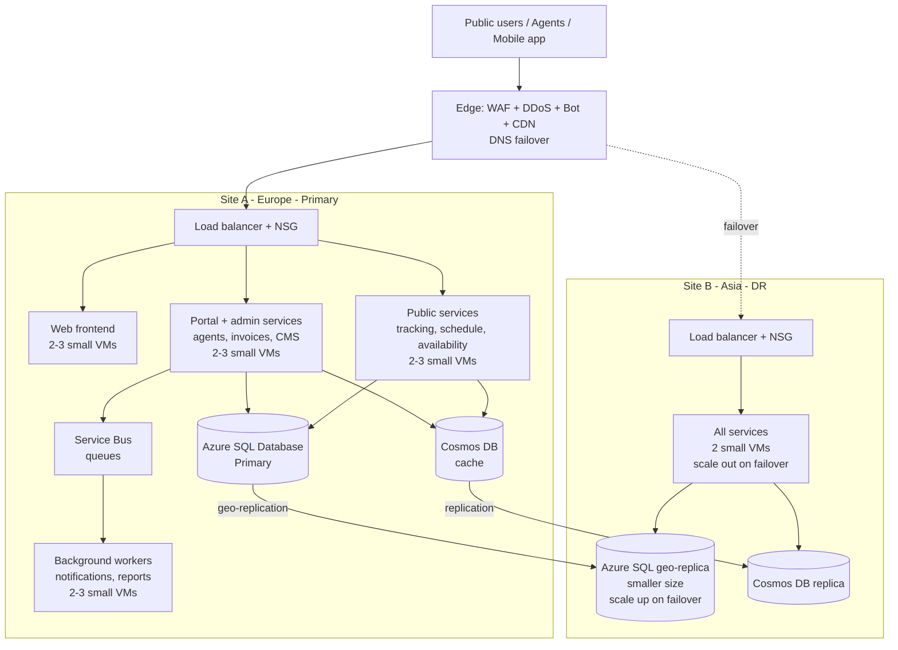

[← Back to index](../README.md)

# 4. High-Level Design

### 4.1 Regions
| Site | Azure region | Continent | Role |
|---|---|---|---|
| Site A | Italy North (Milan) — alternative: West Europe | Europe | Primary, active |
| Site B | UAE North (Dubai) | Asia | DR, minimum capacity, scales up on failover |

Microsoft Azure has no region in Egypt. Both proposed regions provide low latency to Egypt. Data residency is subject to client confirmation (Law 151/2020).

### 4.2 Design principle: scale out, not up
- Each service runs on **small VMs** in its own **scale set**.
- Under load, the platform **adds nodes** (horizontal), up to **3 per service**. It does not move to bigger servers.
- All state lives in managed services (SQL, cache, queue, blob storage), so any node can be added or removed at any time.
- The DR site uses the same pattern: it starts small and scales out and up only when it becomes active.

### 4.3 Logical architecture

The four service groups above are a starting assumption. The final grouping follows the application vendor's microservices design; each group gets its own scale set.

### 4.4 Components
| Layer | Components | Scaling |
|---|---|---|
| Edge | Cloudflare: WAF, DDoS, bot protection, TLS, CDN, DNS failover | Managed |
| Network | Load balancers, Network Security Groups, private subnets | — |
| Presentation | Web frontend (Nginx) | Horizontal, 2 → 3 nodes |
| Services | .NET Core / Java microservices, grouped per service | Horizontal, 2 → 3 nodes per group |
| Workers | Background jobs (notifications, reports, sync) | Horizontal, 2 → 3 nodes |
| Data | Azure SQL Database | Managed, built-in HA in Site A |
| Cache | Azure Cosmos DB (key-value, TTL) | Managed, autoscale throughput |
| Messaging | Azure Service Bus | Managed |
| Files | Azure Blob Storage (documents, media, download center) | Managed, geo-redundant |
| Management | Azure Monitor, log analytics, alerting, jump host with VPN | — |

### 4.5 High availability and disaster recovery
| Item | Proposed value |
|---|---|
| Availability target | 99.9% monthly (production, excluding planned maintenance) |
| Site A | 2+ nodes per service across availability zones; managed SQL with built-in HA |
| DR model | **Minimum-capacity standby** in Site B |
| DR database | Geo-replica on a **smaller compute size**; scaled up to production size at failover |
| DR services | 2 small VMs running all services; scale sets expand to production size at failover |
| Failover | DNS failover at the edge + geo-replica promotion + automatic scale-out |
| RPO | 15 minutes or less |
| RTO | 4 hours or less (aligned with the Critical resolve time) |
| DR test | One failover test during setup; then twice a year |

### 4.6 Backup policy (summary)
| Data | Method | Retention |
|---|---|---|
| Azure SQL | Automated full, differential and log backups (point-in-time restore) | 14 days |
| Azure SQL long-term | Weekly and monthly long-term retention | 4 weeks weekly, 12 months monthly |
| Blob storage | Geo-redundant storage + soft delete | 30 days soft delete |
| Server configuration | Stored as code in the repository; VM images versioned | All versions |
| Restore test | Monthly (Production) | Report to client |

### 4.7 Security
- TLS 1.2+ everywhere; certificates managed and auto-renewed.
- Disk encryption on all servers; SQL TDE for customer data.
- No public access to servers; admin access only through a jump host with VPN and MFA.
- Monthly OS and web server patching; emergency patching for critical vulnerabilities.
- Central security logging and real-time anomaly alerts.
- Data Breach Policy: detection, containment, notification, recovery, post-incident review.

### 4.8 Monitoring and self-healing
- 24/7 automated uptime checks from outside (website, portal, APIs).
- Server, web, service, database, cache and queue metrics.
- Alerts routed to the on-call engineer by phone and app.
- Self-healing: automatic restart of failed services, automatic replacement of unhealthy nodes, scale-out on load.
- Monthly availability and performance report.

### 4.9 Exit strategy
- All infrastructure defined as code (Terraform + Ansible).
- Services run on standard Linux VMs with Nginx: portable to any cloud or on premises.
- Azure SQL uses the standard SQL Server engine: exportable as standard backups at any time.
- Cache and queue are accessed through standard patterns and can be replaced without changing the architecture.
